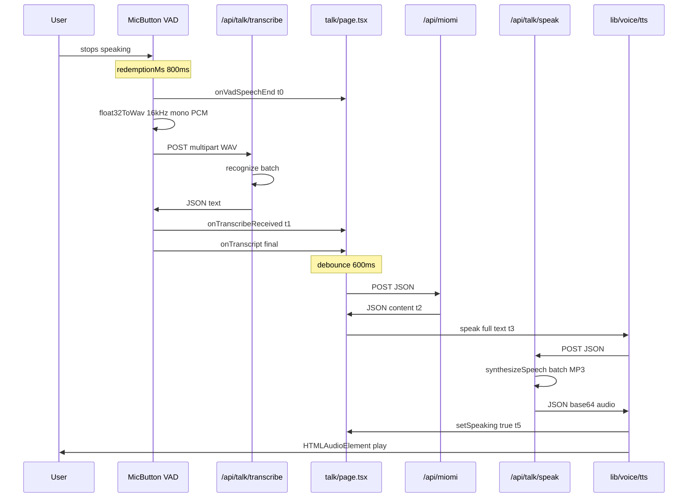

# Voice pipeline latency audit

**Date:** 2026-06-01  
**Scope:** Read-only map of the `/talk` voice path for time-to-first-sound (TTFS) work. Every claim cites `file:line`.

---

## 1. Pipeline map (step by step)

### 1.1 VAD capture — `components/talk/MicButton.tsx`

| Concern | Code fact |
|--------|-----------|
| Library | `@ricky0123/vad-web` `MicVAD.new()` — instance created once on mount, destroyed on unmount (`213:315:components/talk/MicButton.tsx`) |
| When VAD listens | `shouldListen = vadReady && !speakingActive && !locked && !disabled && listenIntent` (`317:318:components/talk/MicButton.tsx`); paused while Miomi speaks (`33:34:components/talk/MicButton.tsx`, `317:318:components/talk/MicButton.tsx`) |
| Buffering model | VAD accumulates frames internally; **one `Float32Array` is delivered on speech end**, not streamed during speech (`249:264:components/talk/MicButton.tsx`) |
| `redemptionMs` | **`800`** in `MicVAD.new({ redemptionMs: 800 })` (`241:241:components/talk/MicButton.tsx`). A debug log incorrectly records `1200` (`289:289:components/talk/MicButton.tsx`) — runtime config is 800 |
| Other VAD timing | `minSpeechMs: 400`, `preSpeechPadMs: 250`, thresholds `0.5` / `0.35` (`237:240:components/talk/MicButton.tsx`) |
| Sample rate | **16000 Hz** — passed to `float32ToWav(audio, 16000)` on speech end and upload (`120:120:components/talk/MicButton.tsx`, `255:255:components/talk/MicButton.tsx`, `488:488:components/talk/MicButton.tsx`) |
| Channels | **Mono** — `numChannels = 1` (`489:489:components/talk/MicButton.tsx`) |
| WAV build | `float32ToWav()`: 16-bit PCM LE, RIFF/WAVE header, `audio/wav` blob (`488:506:components/talk/MicButton.tsx`) |
| Emit pattern | **Single blob after speech-end** → `onSpeechEnd` → `transcribeAndCommitRef.current(audio)` (`249:264:components/talk/MicButton.tsx`). No incremental upload during speech |
| Minimum size gate | Client skips upload if `wavBlob.size < 2000` (`122:125:components/talk/MicButton.tsx`) |
| Turn anchor `t0` | Parent `onVadSpeechEnd` fired from `onSpeechEnd` before upload (`263:263:components/talk/MicButton.tsx`, `428:433:app/(app)/talk/page.tsx`) |

**Functions:** `transcribeAndCommit` (`112:194:components/talk/MicButton.tsx`), `float32ToWav` (`488:506:components/talk/MicButton.tsx`), VAD init IIFE (`213:315:components/talk/MicButton.tsx`).

---

### 1.2 Upload — client → `/api/talk/transcribe`

| Concern | Code fact |
|--------|-----------|
| Endpoint | `POST /api/talk/transcribe` (`136:141:components/talk/MicButton.tsx`) |
| Payload | `multipart/form-data`: field `audio` = WAV blob filename `utterance.wav`; field `language` = `"th"` \| `"en"` \| `"auto"` (`133:135:components/talk/MicButton.tsx`, `54:57:components/talk/MicButton.tsx`) |
| Logged size | `logEvent` includes `wavBytes: wavBlob.size` (`129:129:components/talk/MicButton.tsx`, `260:260:components/talk/MicButton.tsx`) |
| Client timeout | 8s abort (`130:131:components/talk/MicButton.tsx`) |
| Server size limits | Reject `< 2000` bytes, `> 2_000_000` bytes (`252:257:app/api/talk/transcribe/route.ts`) |

---

### 1.3 Transcribe route — `app/api/talk/transcribe/route.ts`

| Concern | Code fact |
|--------|-----------|
| API used | **`client.recognize()`** (batch) with full `content: audioBytes` (`110:114:app/api/talk/transcribe/route.ts`) |
| Not used | No `streamingRecognize` anywhere in repo (grep: zero matches) |
| Primary backend | Google STT V2 Chirp 2, `asia-southeast1`, `languageCodes: ["auto"]` (`15:23:app/api/talk/transcribe/route.ts`, `96:115:app/api/talk/transcribe/route.ts`) |
| Fallback | Groq `whisper-large-v3-turbo` batch transcription (`156:171:app/api/talk/transcribe/route.ts`) |
| Google client | **Module singleton** `getGoogleSpeechClient()` (`27:39:app/api/talk/transcribe/route.ts`) |
| Groq client | **Module singleton** `getGroq()` (`42:47:app/api/talk/transcribe/route.ts`) |
| Response | Single JSON `{ text, servedBy }` (`291:291:app/api/talk/transcribe/route.ts`) |
| Turn anchor `t1` | Set in `handleTranscribeReceived` when MicButton parses OK response (`181:183:components/talk/MicButton.tsx`, `436:440:app/(app)/talk/page.tsx`) |

**Runtime:** `runtime = "nodejs"`, `maxDuration = 15`, `preferredRegion = ["sin1", "hnd1"]` (`1:4:app/api/talk/transcribe/route.ts`).

---

### 1.4 Transcript debounce — `app/(app)/talk/page.tsx`

| Concern | Code fact |
|--------|-----------|
| Debounce ms | **`600`** — `setTimeout(flushBuffer, 600)` (`657:658:app/(app)/talk/page.tsx`) |
| Behavior | Final transcript appended to `transcriptBufferRef`; timer reset on each final segment; `flushBuffer` → `processInput` (`652:658:app/(app)/talk/page.tsx`, `620:624:app/(app)/talk/page.tsx`) |
| Echo / overlap guard | Drops transcript if `micState === "speaking"` or `isSpeakingRef.current` (`636:640:app/(app)/talk/page.tsx`) |

---

### 1.5 LLM — `POST /api/miomi` + `lib/ai/router.ts`

| Concern | Code fact |
|--------|-----------|
| Client call | `fetch("/api/miomi", { method: "POST", body: JSON.stringify({...}) })` (`481:496:app/(app)/talk/page.tsx`) |
| Response shape | **Full JSON** via `NextResponse.json(...)` — client `await res.json()` (`501:501:app/(app)/talk/page.tsx`, `514:529:app/api/miomi/route.ts`) |
| Streaming | **None** — no SSE, no `ReadableStream`, no token iterator in route or client |
| Router Groq | `groq.chat.completions.create(...)` → reads `response.choices[0]?.message?.content` in full (`95:111:lib/ai/router.ts`) |
| Router Gemini | `chat.sendMessage(...)` → reads `response.text` in full (`179:186:lib/ai/router.ts`) |
| Turn anchor `t2` | Set when miomi JSON parsed (`503:504:app/(app)/talk/page.tsx`) |

**Server-side serial work inside `/api/miomi` (same HTTP request, adds wall time):**

1. `getServerProfile()` (`70:70:app/api/miomi/route.ts`)
2. `readBrainState()` (`121:125:app/api/miomi/route.ts`)
3. Optional pronunciation short-circuit (`127:171:app/api/miomi/route.ts`)
4. Guest limit check (`195:224:app/api/miomi/route.ts`)
5. Intent + library match `matchLibraryFromDB()` (`378:378:app/api/miomi/route.ts`)
6. Either library serve or `getAIResponse()` (`387:428:app/api/miomi/route.ts`)
7. Persistence `persistExchangePair()` / `saveExchange()` (`451:458:app/api/miomi/route.ts`)

**Runtime:** No `runtime`, `maxDuration`, or `preferredRegion` exports in `app/api/miomi/route.ts` — uses platform defaults (unlike talk routes pinned to sin1/hnd1).

---

### 1.6 TTS speak route — `app/api/talk/speak/route.ts`

| Concern | Code fact |
|--------|-----------|
| Client trigger | `speak(stripForTts(...))` from `processInput` — **not** `speakReply` (`586:586:app/(app)/talk/page.tsx`) |
| Endpoint | `POST /api/talk/speak` JSON `{ text, lang }` (`231:234:lib/voice/tts.ts`) |
| Synthesis | **`client.synthesizeSpeech(...)`** awaited to completion; full `audioContent` buffered (`143:166:app/api/talk/speak/route.ts`) |
| Streaming | **None** — single JSON `{ audio: base64, cached: boolean }` (`134:134:app/api/talk/speak/route.ts`, `220:220:app/api/talk/speak/route.ts`) |
| Encoding | Google returns **MP3** (`audioEncoding: "MP3"`) (`147:147:app/api/talk/speak/route.ts`) |
| Google TTS client | **`new TextToSpeechClient({ credentials })` per cache-miss request** (`140:141:app/api/talk/speak/route.ts`) — **not** a singleton |
| Cache | Supabase `tts_cache` read before synth; hit returns cached base64 without Google call (`110:134:app/api/talk/speak/route.ts`) |
| Synth timeout | 18s race (`153:155:app/api/talk/speak/route.ts`) |
| Turn anchor `t3` | Set when `speak()` invoked (`577:578:app/(app)/talk/page.tsx`) — **not used in `[turn-timing]` line** |

**Runtime:** `runtime = "nodejs"`, `maxDuration = 25`, `preferredRegion = ["sin1", "hnd1"]` (`1:4:app/api/talk/speak/route.ts`).

**Chunked TTS (unused in production path):** `speakReply`, `speakChunkedSequence`, `splitReplyIntoTtsChunks` exist in `lib/voice/tts.ts` (`364:467:lib/voice/tts.ts`) but **`/talk` calls `speak` only** (`586:586:app/(app)/talk/page.tsx`). No imports of `speakReply` outside `tts.ts`.

---

### 1.7 Playback — `lib/voice/tts.ts`

| Concern | Code fact |
|--------|-----------|
| Entry | `speak()` → `trySpeakViaServer()` (`469:486:lib/voice/tts.ts`) |
| Fetch | `fetchServerAudio()` — up to **3 attempts**, 600ms backoff on retry (`224:251:lib/voice/tts.ts`) |
| Playback | **Single MP3 clip**: `data:audio/mp3;base64,...` on one `HTMLAudioElement` (`277:277:lib/voice/tts.ts`, `265:266:lib/voice/tts.ts`) |
| Chunked playback | Only in unused `speakChunkedSequence` (`378:448:lib/voice/tts.ts`) |
| Browser TTS fallback | **Removed** — on server failure, logs and stays silent (`483:485:lib/voice/tts.ts`) |
| Speaking flag | `setSpeaking(true)` in `playServerAudioChunk` immediately before `el.play()` (`302:303:lib/voice/tts.ts`) |
| Audio chain | Optional Web Audio compressor/gain on shared `AudioContext` (`147:159:lib/voice/tts.ts`) |
| Turn anchor `t5` | Set when `subscribeSpeaking` fires `speaking === true` (`236:244:app/(app)/talk/page.tsx`) |

---

## 2. Batch vs streaming (definitive)

| Stage | Mode | Evidence |
|-------|------|----------|
| **ASR (Google)** | **Batch** | `client.recognize({ content: audioBytes })` (`110:114:app/api/talk/transcribe/route.ts`) |
| **ASR (Groq fallback)** | **Batch** | `groq.audio.transcriptions.create({ file: audioBlob })` (`170:170:app/api/talk/transcribe/route.ts`) |
| **VAD → server** | **Batch** | One WAV blob post–speech-end (`249:264:components/talk/MicButton.tsx`, `133:134:components/talk/MicButton.tsx`) |
| **LLM (Groq)** | **Batch** | Full completion object, no `stream: true` (`95:111:lib/ai/router.ts`) |
| **LLM (Gemini)** | **Batch** | `sendMessage` → full `response.text` (`179:186:lib/ai/router.ts`) |
| **LLM (HTTP)** | **Batch** | Single `NextResponse.json` (`514:529:app/api/miomi/route.ts`) |
| **TTS (Google)** | **Batch** | `await client.synthesizeSpeech(...)`; entire MP3 in `audioContent` (`143:166:app/api/talk/speak/route.ts`) |
| **TTS (HTTP)** | **Batch** | Single JSON with full base64 audio (`220:220:app/api/talk/speak/route.ts`) |
| **TTS (playback)** | **Batch fetch, single clip** | One `/api/talk/speak` round-trip per reply via `speak()` (`307:328:lib/voice/tts.ts`, `586:586:app/(app)/talk/page.tsx`) |

---

## 3. `[turn-timing]` anchors

Defined in `app/(app)/talk/page.tsx` (`60:93:app/(app)/talk/page.tsx`, `428:440:app/(app)/talk/page.tsx`, `503:504:app/(app)/talk/page.tsx`, `577:578:app/(app)/talk/page.tsx`, `236:244:app/(app)/talk/page.tsx`).

| Anchor | Event | When set |
|--------|-------|----------|
| **t0** | VAD `onSpeechEnd` (post–redemption silence) | `handleVadSpeechEnd` (`428:433:app/(app)/talk/page.tsx`) |
| **t1** | `/api/talk/transcribe` OK, before `onTranscript` | `handleTranscribeReceived` (`436:440:app/(app)/talk/page.tsx`, `181:183:components/talk/MicButton.tsx`) |
| **t2** | `/api/miomi` JSON received | After `res.json()` (`503:504:app/(app)/talk/page.tsx`) |
| **t3** | `speak()` called | Before TTS fetch (`577:578:app/(app)/talk/page.tsx`) — recorded but **not printed** |
| **t5** | First audible playback | `subscribeSpeaking(true)` (`236:244:app/(app)/talk/page.tsx`) |

**Logged line:**

```
ASR  = t1 − t0
LLM  = t2 − t1
TTS  = t5 − t2   (or TTS=n/a if t5 never set)
TOTAL = (t5 ?? t2) − t0
```

(`75:84:app/(app)/talk/page.tsx`)

### Does TOTAL equal “user stops speaking → first audio plays”?

**No.**

| Gap | Why |
|-----|-----|
| **VAD `redemptionMs` (~800 ms)** | Occurs **before** `t0`. User has stopped phonating, but VAD waits for trailing silence. Not in any logged segment (`241:241:components/talk/MicButton.tsx`, `249:263:components/talk/MicButton.tsx`). |
| **600 ms debounce** | Runs **after `t1`**, before `/api/miomi` fetch. It is **included inside the LLM bucket** (t1→t2), not ASR (`657:658:app/(app)/talk/page.tsx`). |
| **TTS fetch + decode** | Included in TTS bucket (t2→t5), ending at `setSpeaking(true)` / `play()`, not at LLM completion (`302:303:lib/voice/tts.ts`, `236:244:app/(app)/talk/page.tsx`). |

**True TTFS (conceptual):**

```
redemptionMs (~800)
  + ASR bucket (upload + transcribe + server)
  + debounceMs (600)        ← inside LLM bucket in logs
  + miomi server time       ← inside LLM bucket in logs
  + speak HTTP + synth      ← inside TTS bucket in logs
  + client decode + play()  ← inside TTS bucket in logs
```

Keyboard turns: `t0 = t1 = performance.now()` at `processInput` start; `asr=keyboard` (`455:462:app/(app)/talk/page.tsx`).

---

## 4. Audio formats and typical size

### Capture (client → transcribe)

| Property | Value | Citation |
|----------|-------|----------|
| Container | WAV (RIFF) | `488:506:components/talk/MicButton.tsx` |
| Codec | Uncompressed **PCM** 16-bit LE | `489:489:components/talk/MicButton.tsx`, `501:504:components/talk/MicButton.tsx` |
| Sample rate | **16000 Hz** | `120:120:components/talk/MicButton.tsx` |
| Channels | **1 (mono)** | `489:489:components/talk/MicButton.tsx` |
| MIME | `audio/wav` | `506:506:components/talk/MicButton.tsx` |

**Byte size:** `wavBytes` logged at speech end and upload (`260:260:components/talk/MicButton.tsx`, `129:129:components/talk/MicButton.tsx`). Formula: `44 + samples.length × 2` (`492:492:components/talk/MicButton.tsx`). At 16 kHz mono 16-bit ≈ **32 KB/s** payload (+44 B header).

Example durations:

| Duration | Approx. `wavBytes` |
|----------|-------------------|
| 3 s | ~96 KB |
| 6 s | ~192 KB |
| 12 s | ~384 KB |

Server accepts up to **2_000_000** bytes (~62 s at 32 KB/s) (`252:253:app/api/talk/transcribe/route.ts`). Hypothesis “~100–388 KB” is **plausible** for ~3–12 s utterances; not hardcoded — always derived from sample count.

### Playback (speak → client)

| Property | Value | Citation |
|----------|-------|----------|
| Codec | **MP3** (Google Chirp3-HD voices) | `147:147:app/api/talk/speak/route.ts` |
| Transport | Base64 in JSON | `220:220:app/api/talk/speak/route.ts`, `265:265:lib/voice/tts.ts` |

---

## 5. Round trips and cold-start risk

### 5.1 Client HTTP round trips per voice turn (happy path)

| # | Request | Citation |
|---|---------|----------|
| 1 | `POST /api/talk/transcribe` (multipart WAV) | `136:141:components/talk/MicButton.tsx` |
| 2 | `POST /api/miomi` (JSON) | `481:496:app/(app)/talk/page.tsx` |
| 3 | `POST /api/talk/speak` (JSON) | `231:234:lib/voice/tts.ts` |

**= 3 client round trips** when TTS is on and cache misses. Cache hit on speak skips Google synth but **still one HTTP call** to `/api/talk/speak` (`110:134:app/api/talk/speak/route.ts`).

Retries: `fetchServerAudio` may repeat speak up to 3× with 600 ms delay (`224:251:lib/voice/tts.ts`).

### 5.2 Serverless functions in path

| Route | `runtime` | `preferredRegion` | `maxDuration` | Heavy deps / cold-start notes |
|-------|-----------|-------------------|---------------|-------------------------------|
| `/api/talk/transcribe` | `nodejs` | `sin1`, `hnd1` | **15 s** | `@google-cloud/speech` v2, `groq-sdk`; **singleton clients** (`27:47:app/api/talk/transcribe/route.ts`) |
| `/api/miomi` | *(default)* | *(not pinned in route)* | *(not set)* | `@google/genai`, `groq-sdk` (router singletons `15:28:lib/ai/router.ts`); Supabase reads/writes; library matcher |
| `/api/talk/speak` | `nodejs` | `sin1`, `hnd1` | **25 s** | `@google-cloud/text-to-speech`; Supabase service client; **`new TextToSpeechClient` every cache miss** (`140:141:app/api/talk/speak/route.ts`) |

Package versions: `@google-cloud/speech`, `@google-cloud/text-to-speech`, `groq-sdk`, `@google/genai` (`14:16:package.json`).

### 5.3 Per-request client construction

| Client | Pattern | Citation |
|--------|---------|----------|
| Google STT | Singleton | `30:39:app/api/talk/transcribe/route.ts` |
| Groq (transcribe) | Singleton | `42:47:app/api/talk/transcribe/route.ts` |
| Groq / Gemini (router) | Singleton | `15:28:lib/ai/router.ts` |
| **Google TTS** | **New instance per synth** | `140:141:app/api/talk/speak/route.ts` |
| Supabase (speak cache) | `createServiceClient()` per request | `104:104:app/api/talk/speak/route.ts` |

---

## 6. Serialization and dead time

### 6.1 Per-turn stage ordering (no overlap)

Within one turn, stages are strictly sequential:

```
speech-end → WAV upload → transcribe JSON
  → onTranscript → [600 ms debounce]
  → processInput → miomi JSON
  → speak() → fetch speak JSON (full synth)
  → play single MP3
```

Citations: `249:264:components/talk/MicButton.tsx`, `657:658:app/(app)/talk/page.tsx`, `481:501:app/(app)/talk/page.tsx`, `586:586:app/(app)/talk/page.tsx`, `307:328:lib/voice/tts.ts`.

No pipelining (e.g. LLM tokens → TTS, or chunked `speakReply`) is active on `/talk`.

### 6.2 Pre-LLM dead time (voice)

| Delay | ms | Position | In `[turn-timing]`? |
|-------|-----|----------|---------------------|
| `redemptionMs` | **800** | After user stops talking, before `t0` | **No** (before t0) |
| Upload + ASR | variable | `t0` → `t1` | **ASR** |
| Transcript debounce | **600** | After `t1`, before `processInput` | **Inside LLM** (t1→t2) |

(`241:241:components/talk/MicButton.tsx`, `657:658:app/(app)/talk/page.tsx`)

**Not** `800 + 600 = 1400 ms` before miomi **starts** in the log: redemption is pre-t0; debounce is post-t1 inside LLM bucket. Wall time from last phoneme to miomi fetch ≈ **`800 + ASR + 600`**.

Additional VAD params affecting turn boundaries: `minSpeechMs: 400`, `preSpeechPadMs: 250` (`239:240:components/talk/MicButton.tsx`).

### 6.3 In-flight turn serialization

| Mechanism | Serializes turns? | Citation |
|-----------|-------------------|----------|
| `processInput` mutex | **No** — no in-flight guard | `443:616:app/(app)/talk/page.tsx` |
| `micState === "processing"` on button | Blocks **tap** only, not VAD | `377:377:components/talk/MicButton.tsx` |
| VAD during processing | **Can still listen** — `shouldListen` ignores processing | `317:318:components/talk/MicButton.tsx` |
| Echo drop while speaking | Drops transcript during TTS | `636:640:app/(app)/talk/page.tsx` |
| `turnTimingRef` overwrite | New speech-end **replaces** timing struct | `428:433:app/(app)/talk/page.tsx` |

**Conclusion:** Stages within a turn are serial; **multiple turns can overlap** if the user speaks again during processing/LLM.

---

## 7. Hypothesis verdicts

| ID | Hypothesis | Verdict | Notes |
|----|------------|---------|-------|
| **H1** | ASR is batch (`recognize`, not `streamingRecognize`) | **CONFIRMED** | `110:114:app/api/talk/transcribe/route.ts`; no streaming API in repo |
| **H2** | LLM is batch (router full content; `/api/miomi` one JSON) | **CONFIRMED** | `95:111:lib/ai/router.ts`, `179:186:lib/ai/router.ts`, `501:501:app/(app)/talk/page.tsx`, `514:529:app/api/miomi/route.ts` |
| **H3** | TTS is batch; chunked path reverted/unused | **CONFIRMED** | Full synth `143:166:app/api/talk/speak/route.ts`; `/talk` uses `speak` not `speakReply` `586:586:app/(app)/talk/page.tsx` |
| **H4** | Pipeline fully serial — no stage overlaps | **PARTIAL** | **Within one turn:** yes. **Across turns:** no mutex; VAD can run during processing `317:318:components/talk/MicButton.tsx`. Chunked overlap code exists but unused `378:448:lib/voice/tts.ts` |
| **H5** | Uncompressed WAV/PCM, ~100–388 KB, ONE blob after speech-end | **CONFIRMED** (size range plausible, not fixed) | PCM WAV mono 16 kHz `488:506:components/talk/MicButton.tsx`; single post-end blob `249:264:components/talk/MicButton.tsx`; sizes logged as `wavBytes` |
| **H6** | ~3 HTTP round trips (transcribe, miomi, speak) | **CONFIRMED** | See §5.1 |
| **H7** | redemption = 1200 ms, debounce = 600 ms → ~1.8 s before LLM | **CORRECTED** | **redemption = 800 ms** in VAD config `241:241:components/talk/MicButton.tsx` (log at `289:289` says 1200 — stale). **debounce = 600 ms** `657:658:app/(app)/talk/page.tsx`. Debounce is **after** transcript (post-t1), not before. Pre-miomi wall ≈ **800 + ASR + 600**, not a fixed 1800 ms |
| **H8** | Speak route builds Google TTS client per request | **CONFIRMED** | `new TextToSpeechClient({ credentials })` on each cache miss `140:141:app/api/talk/speak/route.ts`. Contrast STT singleton `30:39:app/api/talk/transcribe/route.ts` |

---

## 8. TTFS attack surface (code-derived priorities)

Ordered by what the current instrumentation **under-counts** or **serializes**:

1. **Pre-t0 `redemptionMs` (800 ms)** — largest fixed gap missing from TOTAL (`241:241:components/talk/MicButton.tsx`, `428:433:app/(app)/talk/page.tsx`).
2. **600 ms transcript debounce** — fixed post-ASR delay; bundled into LLM metric (`657:658:app/(app)/talk/page.tsx`).
3. **Batch ASR on full WAV** — no partial results (`110:114:app/api/talk/transcribe/route.ts`).
4. **Batch LLM** — no speech until full reply (`501:501:app/(app)/talk/page.tsx`).
5. **Batch TTS + third HTTP hop** — full MP3 before play (`143:166:app/api/talk/speak/route.ts`, `307:312:lib/voice/tts.ts`).
6. **Per-request TTS client** — cold OAuth/client setup on speak miss (`140:141:app/api/talk/speak/route.ts`).
7. **Unused chunked path** — `speakReply` would overlap synth/playback but is not wired (`586:586:app/(app)/talk/page.tsx` vs `452:467:lib/voice/tts.ts`).

---

## 9. End-to-end diagram



---

*Generated from repository state 2026-06-01. Read-only audit — no application code changed.*
